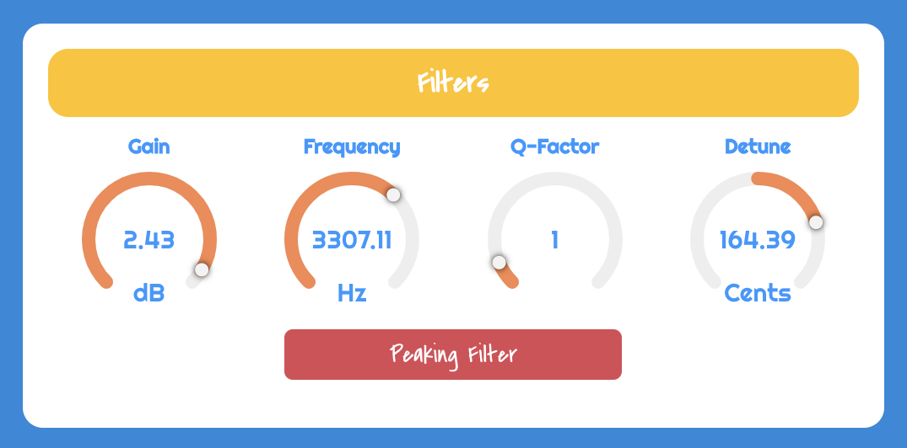
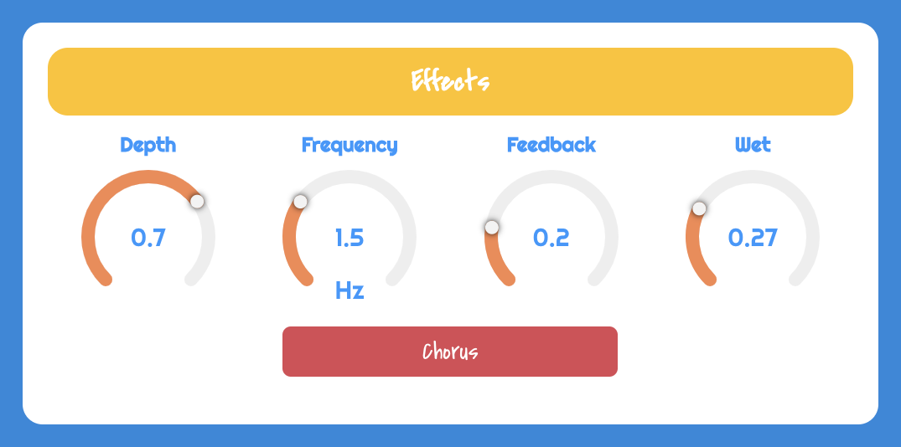
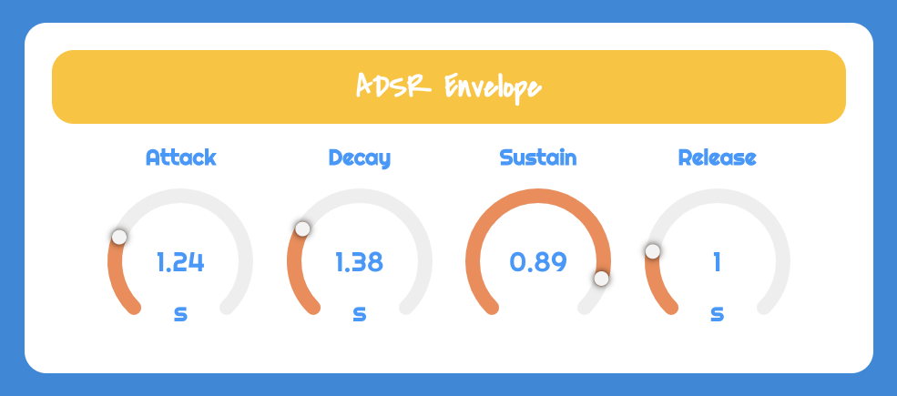
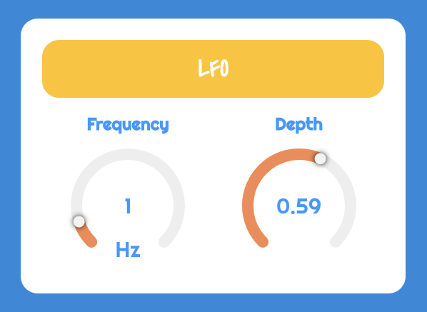
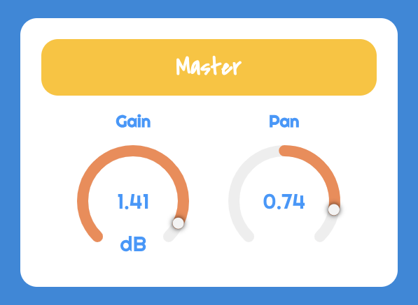

# SubJuicy

SubJuicy is a monophonic synthesizer based on subtractive synthesis featuring four different filters, effects and tremolo controls. The app was developed by means of the following libraries:
- [Vue.js](https://vuejs.org/)
- [Tone.js](https://tonejs.github.io/)

Moreover, [Web MIDI API](https://developer.mozilla.org/en-US/docs/Web/API/Web_MIDI_API) is employed to manage MIDI devices connection.

## Synth Controls and Graphical User Interface

SubJuicy synthesizer provides the user with different controls sections. In the following all the data controls are shown and explained.

**Sources Controls**  
The user can control three different oscillators and a noise source. Available parameters are:
- **Oscillators Gain**: for individually setting *volume* of each oscillator node
- **Oscillators Type**: 4 types of *waveshape* are available (sine, triangle, square, sawtooth) and selectable through a drop down menu
- **Noise Gain**: sets the *volume* of the noise source node
- **Noise Type**: 2 *types of noise* are selectable (white and pink)

    

**Filters Controls**  
Four types of filters can be controlled from the graphical user interface. Each filter is implemented as a Tone.js BiquadFilter node. Available filters are: **Low-Pass**, **High-Pass**, **Peaking**, and **Notch filter**. Controllable parameters are listed below:
- **Frequency**: sets the *cut-off frequency* of the filter
- **Q-Factor**: for setting *quality factor*
- **Detune**: sets the *detune* parameter
- **Gain**: available only for *Peaking Filter*

    

The user can navigate through filters controls by clicking on the red button indicating the type of the filter that is currently displayed within the user interface. Every time the button is clicked controls of the following filters are made visible and its type denomination is shown as well. Filters are rendered according to the order indicated above.

**Effects Controls**  
Effects controls are shown by clicking on the corresponding button which is located at the top-right of SubJuicy interface. Indeed, within the navigation bar of the synth GUI the user can find two buttons, responsible for Filters and Effects controls rendering. Available effects are listed in the following:

- **Chorus** audio node implements a stereo chorus effect consisting of a left and right delay with an LFO that is applied to the delayTime of each channel.
  - **Depth**: sets the *depth* of chorus effect
  - **Frequency**: sets the *frequency* of the LFO modulating the delay time
  - **Feedback**: controls the *amount of feedback* from the output back into the input of the effect node
  - **Wet**: manages *dry/wet balance* at the output of the audio node
 
- **Phaser** node works by changing the phase of different frequency components of an incoming signal.
  - **Base Frequency**: controls the *cut-off frequency* of the filter
  - **Frequency**: sets the *frequency* of the effect
  - **Wet**: for setting *dry/wet balance* at the output of the audio node
 
- **Reverb** audio node implements a simple convolution created with decaying noise. Controllable parameters are:
  - **Decay**: sets the *reverb duration*
  - **Pre-Delay**: controls the *amount of time the reverb is fully ramped in*
  - **Wet**: manages *dry/wet balance*

- **Ping-Pong Delay** node implements a feedback delay effect here the echo is heard first in one channel and next in the opposite channel
  - **Delay Time**: controls *delay time*
  - **Feedback**: sets *feedback* of the delay
  - **Wet**: sets *dry/wet balance* at the output of the audio node
 

    

**Amplitude Envelope Controls**  
Amplitude Envelope is implemented as an *ADSR envelope*.

- **Attack**
- **Decay**
- **Sustain**
- **Release**

    

**LFO Controls**  
LFO block is implemented as a Tone.js Tremolo node. The user can control the parameters below:

- **Frequency**: sets the *frequency* of the tremolo effect
- **Depth**: controls the *depth* of the effect

    

**Master Controls**  
Master section enables the user to set:

- **Master Gain**: sets the *master gain* of the synth sound that has been shaped
- **Pan**: pan parameter controls is implemented by means of Tone.js Panner node which is an *equal power Left/Right channel*

    

## App Architecture and State Update
The app provides different types of controls enabling the user to find the desired parameters configuration and shape the sound as wanted. All the functional blocks integrated in the signal flow of the application were implemented as **Vue components**. The state of the synth is managed and updated within the **SynthDevice** component, which handles *sound generation* and *signal processing* by means of Tone.js library. Each component allows the user to interact with the application and update the parameters related to the corresponding signal processing functional block.  
**Vue watchers** are employed in order to automatically *update component data* and *emit events* that are dispatched to the parent SynthDevice. Indeed, any time parameters are changed from the user interface, data in the child component are automatically updated and the **onUpdateState event** is fired and sent to the parent. This event is attached to the **updateState function** which is implemented in SynthDevice component and responsible for *state update* based on the parameter name received from the child.

The diagram above shows how the architecture of the application is organized in vue components and parameters are passed from leave components to SynthDevice where the overall synth state is updated. An external Vue component (**vue-three-round-slider** module, imported and used in the app as **RoundSlider** component) was employed to integrate *circular slider* within the graphical user interface for a more pleasant and comfortable user interaction with the software.

## Signal Flow

Signal processing is implemented through Tone.js audio nodes that are connected together building the signal flow.

