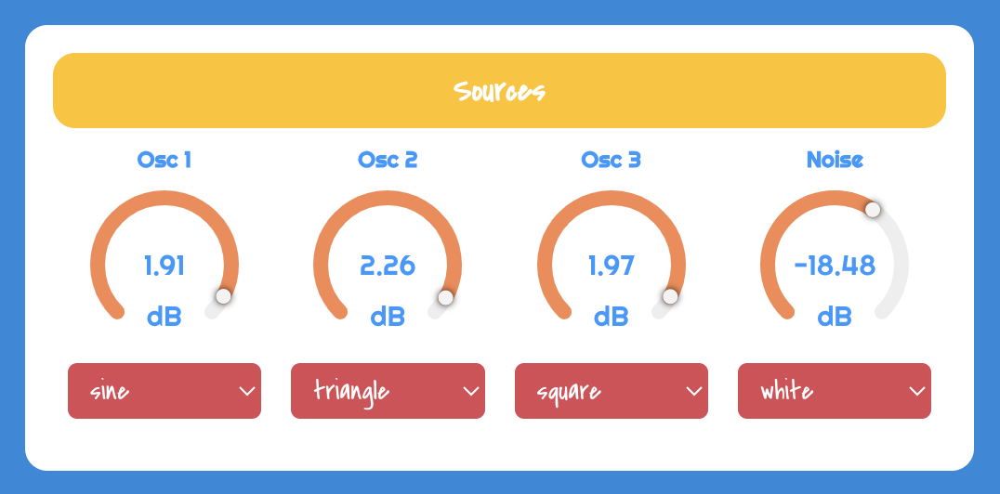

# SubJuicy

SubJuicy is a monophonic synthesizer based on subtractive synthesis featuring four different filters, effects and tremolo controls. The app was developed by means of the following libraries:
- [Vue.js](https://vuejs.org/)
- [Tone.js](https://tonejs.github.io/)

Moreover, [Web MIDI API](https://developer.mozilla.org/en-US/docs/Web/API/Web_MIDI_API) is employed to manage MIDI devices connection.

## Synth Controls and Graphical User Interface

SubJuicy synthesizer provides the user with different controls sections. In the following all the data controls are shown and explained.

**Sources Controls**
    The user can control three different oscillators and a noise source. Available parameters are:
  - **Oscillators Gain**: for individually setting volume of each oscillator node
  - **Oscillators Type**: 4 types of waveshape are available (sine, triangle, square, sawtooth) and selectable through a drop down menu
  - **Noise Gain**: sets the volume of the noise source node
  - **Noise Type**: 2 types of noise are selectable (white and pink)

    

**Filters Controls** 
    Four types of filters can be controlled from the graphical user interface. Each filter is implemented as a Tone.js BiquadFilter node. Available filters are: Low-Pass, High-Pass, Peaking, and Notch filter. Controllable parameters are listed below:
    - **Frequency**
    - **Q-Factor**
    - **Detune**
    - **Gain**: only for *Peaking Filter*
  

- **Effects Controls**

- **Amplitude Envelope Controls**

- **LFO Controls**

- **Master Controls**

## App Architecture and State Update
The app provides different types of controls enabling the user to find the desired parameters configuration and shape the sound as wanted. All the functional blocks integrated in the signal flow of the application were implemented as **Vue components**. The state of the synth is managed and updated within the **SynthDevice** component, which handles *sound generation* and *signal processing* by means of Tone.js library. Each component allows the user to interact with the application and update the parameters related to the corresponding signal processing functional block.  
**Vue watchers** are employed in order to automatically *update component data* and *emit events* that are dispatched to the parent SynthDevice. Indeed, any time parameters are changed from the user interface, data in the child component are automatically updated and the **onUpdateState event** is fired and sent to the parent. This event is attached to the **updateState function** which is implemented in SynthDevice component and responsible for *state update* based on the parameter name received from the child.

The diagram above shows how the architecture of the application is organized in vue components and parameters are passed from leave components to SynthDevice where the overall synth state is updated. An external Vue component (**vue-three-round-slider** module, imported and used in the app as **RoundSlider** component) was employed to integrate *circular slider* within the graphical user interface for a more pleasant and comfortable user interaction with the software.

## Signal Flow

Signal processing is implemented through Tone.js audio nodes that are connected together building the signal flow.

